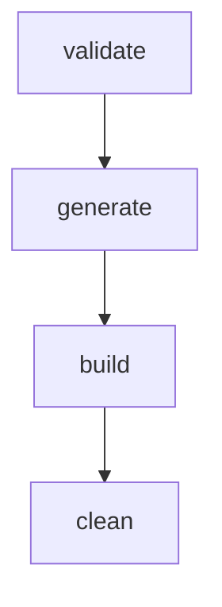

# ModSmith

**ModSmith** is a local automation tool for generating recipe-only Minecraft mods across multiple mod loaders and Minecraft version ranges using unpacked mod templates.

---

## Workflow

ModSmith is designed around a simple, four-step local development workflow:



1. **`validate`**: Analyzes your workspace layout, parses `modsmith.json`, verifies templates, checks that required recipes exist and parse correctly, and ensures necessary development tools (like Git) are present on your system path.
   ```sh
   python -m modsmith validate
   ```
2. **`generate`**: Overwrites or creates the target Git repository under `MODS/<output_repo_name>`. It produces one **orphan branch per target** (no common main branch exists), copies templates, translates recipes, runs verification checks, and commits them locally.

   ```sh
   # Standard generation (fails if target directory exists)
   python -m modsmith generate

   # Force generation (deletes and overwrites target directory)
   python -m modsmith generate --force
   ```

3. **`build`**: Checks out each configured target branch one by one, runs the template's embedded Gradle wrapper (`gradlew clean build`), checks for compiler/build issues, and copies the resulting production JAR files to your workspace.
   ```sh
   python -m modsmith build
   ```
4. **`clean`**: Deletes the generated repository under `MODS/<output_repo_name>` using an OS-robust recursive deletion routine that overcomes Windows permission and file handle locks.

   ```sh
   # Interactively prompts for confirmation
   python -m modsmith clean

   # Skips confirmation prompts
   python -m modsmith clean --force
   ```

> [!TIP]
> The `generate`, `build`, and `clean` commands all support a `--dry-run` flag. Pass `--dry-run` to print details about what directories or branches would be touched without executing any file modifications, Git operations, or Gradle runs.

---

## Folder Layout

In ModSmith, development resides in the workspace and templates folders, keeping them decoupled from compilation and generation artifacts.

```
ModSmith/
├── MODTEMPLATES/               # Unpacked template mod projects (gitignored)
│   ├── forge-1.20.1/
│   ├── forge-1.21-1.21.1/
│   └── fabric-1.21.2-1.21.11/
│
├── WORKSPACE/                  # Local user-managed workspace (gitignored)
│   ├── DETAILS/
│   │   └── modsmith.json       # The mod definition and targets list
│   ├── RECIPES/
│   │   └── *.json              # Recipe files (1.20 or 1.21 format)
│   ├── README/
│   │   └── README.md           # Optional README copied to each target branch
│   └── DIST/                   # Output directory where finished release JARs are copied
│
└── MODS/                       # Output folder (gitignored)
    └── <output_repo_name>/     # Generated Git repo (one orphan branch per target)
```

> [!WARNING]
> The directories `MODS/`, `MODTEMPLATES/`, and `WORKSPACE/` represent your local environment. In active source repositories, make sure they are included in your `.gitignore` to prevent committing templates, user definitions, or compiled binary outputs.

---

## Configuration (`modsmith.json`)

Your mod is configured via `WORKSPACE/DETAILS/modsmith.json`. Below is an example:

```json
{
  "mod_id": "easypeasygunpowder",
  "mod_name": "Easy Peasy Gunpowder",
  "mod_version": "1.1.0",
  "group": "com.ardaryusz.easypeasygunpowder",
  "package": "com.ardaryusz.easypeasygunpowder",
  "authors": "ardaryusz",
  "license": "MIT",
  "description": "Adds simple crafting recipes for gunpowder.",
  "output_repo_name": "EasyPeasyGunpowder",
  "targets": [
    {
      "loader": "forge",
      "template": "forge-1.20.1",
      "branch": "forge-1.20.1",
      "mc_range": "1.20.1",
      "minecraft_version": "1.20.1",
      "minecraft_version_range": "[1.20.1,1.20.2)"
    },
    {
      "loader": "fabric",
      "template": "fabric-1.21.2-1.21.11",
      "branch": "fabric-1.21.2-1.21.11",
      "mc_range": "1.21.2-1.21.11",
      "minecraft_version": "1.21.2"
    }
  ]
}
```

### Key Fields:

- `mod_id`: Lowercase alphanumeric identifier starting with a letter.
- `package`: Java package for your generated initializer class.
- `main_class` _(Optional)_: The name of your mod's main entry point class. If omitted, derived directly from `mod_name` in PascalCase (e.g., `EasyPeasyGunpowder`).
- `targets`: One or more configurations specifying `loader` (`forge`, `neoforge`, `fabric`), the unpacked `template` folder name, the destination Git `branch` name, and Minecraft version specifications.

---

## Recipe Format Conversion

ModSmith provides zero-overhead recipe conversion between Minecraft version formats. You can write your recipes in either format inside `WORKSPACE/RECIPES/`, and ModSmith automatically normalizes them:

### 1. Legacy Format (Minecraft 1.20.1 and below)

- Folder convention: `recipes`
- Shaped recipe grid keys use object notation:
  ```json
  "C": { "item": "minecraft:charcoal" }
  ```
- Recipe results use the `item` field:
  ```json
  "result": { "item": "minecraft:gunpowder", "count": 1 }
  ```

### 2. Modern Format (Minecraft 1.21 and above)

- Folder convention: `recipe`
- Shaped recipe grid keys use direct strings:
  ```json
  "C": "minecraft:charcoal"
  ```
- Recipe results use the `id` field:
  ```json
  "result": { "id": "minecraft:gunpowder", "count": 1 }
  ```

---

## Git Branches & Verification

During `generate`, ModSmith isolates each build environment using independent Git branches:

- **Orphan branch generation**: Each target branch is created as a Git orphan, meaning it shares no commit history with other targets.
- **Checked-out state**: After generation finishes, the first configured target is kept active/checked-out.
- **Verification step**: Before commits are finalized, ModSmith conducts a generated-project verification. It checks that default placeholder class files (such as Forge's `ExampleMod.java`) are cleanly deleted, Java packages match configurations, mod imports are valid, and recipe JSON files match target format.

---

## Build Output & JAR Naming

Compiled JAR outputs from `build` are copied to `WORKSPACE/DIST/` and follow a standard naming convention:

```
<mod_id>-<mc_range>-<loader>-<mod_version>.jar
```

_Example_: `easypeasygunpowder-1.20.1-forge-1.1.0.jar`

---

## Template Descriptor (`modsmith-template.json`)

To customize how a template is read, you can place a `modsmith-template.json` file inside any `MODTEMPLATES/` template directory:

```json
{
  "loader": "forge",
  "minecraft_version": "1.20.1",
  "recipe_folder": "recipes",
  "recipe_format": "legacy_1_20",
  "metadata_files": ["src/main/resources/META-INF/mods.toml"],
  "java_mod_import": "net.minecraftforge.fml.common.Mod",
  "uses_generated_metadata": false,
  "jar_loader_suffix": "forge"
}
```

_If this descriptor is missing, ModSmith will emit a warning during validation and fall back on robust heuristics._

---

## Installation

### Windows Installer (recommended)

Download `ModSmithSetup.exe` and run it. The installer will:

1. Install `modsmith.exe` and runtime files to `C:\Program Files\ModSmith` (configurable).
2. Create your workspace folder structure under `Documents\ModSmith`:
   ```
   Documents\ModSmith\
   ├── MODTEMPLATES\           # Place unpacked mod templates here
   ├── WORKSPACE\
   │   ├── DETAILS\            # Put modsmith.json here
   │   ├── RECIPES\            # Put recipe JSON files here
   │   ├── README\             # Optional README for generated branches
   │   └── DIST\               # Built JARs are copied here
   └── MODS\                   # Generated Git repos appear here
   ```
3. Set the `MODSMITH_HOME` environment variable to `Documents\ModSmith`.
4. Optionally add the install directory to your `PATH`.
5. Create a **ModSmith Command Prompt** Start Menu shortcut that opens PowerShell in your workspace.

After installation, open "ModSmith Command Prompt" from the Start Menu and run:

```sh
modsmith --help
```

> [!IMPORTANT]
> The installer does **not** bundle Forge, NeoForge, or Fabric MDK templates. You must download and unpack the appropriate mod development kits into `Documents\ModSmith\MODTEMPLATES\` yourself.

### Uninstalling

The uninstaller removes application files from Program Files and cleans up PATH and environment variables. It does **not** delete your `Documents\ModSmith` folder by default — your templates, recipes, generated mods, and built JARs are preserved.

### From Source (pip)

```sh
pip install -e ".[dev]"
python -m modsmith --help
```

---

## MODSMITH_HOME

ModSmith supports a `MODSMITH_HOME` environment variable that controls where the tool looks for its workspace, templates, and output directories by default.

| `MODSMITH_HOME`   | `--workspace` default          | `--templates` default            | `--mods` default          |
|-------------------|--------------------------------|----------------------------------|---------------------------|
| _(not set)_       | `./WORKSPACE`                  | `./MODTEMPLATES`                 | `./MODS`                  |
| `C:\Users\You\Documents\ModSmith` | `C:\Users\You\Documents\ModSmith\WORKSPACE` | `C:\Users\You\Documents\ModSmith\MODTEMPLATES` | `C:\Users\You\Documents\ModSmith\MODS` |

Explicit CLI flags (`--workspace`, `--templates`, `--mods`) always override the environment variable.

The Windows installer sets `MODSMITH_HOME` automatically. If you install from source and want the same behaviour, set it yourself:

```powershell
[Environment]::SetEnvironmentVariable("MODSMITH_HOME", "$HOME\Documents\ModSmith", "User")
```

---

## Requirements

- **Python 3.10+** (not needed if using the Windows installer)
- **Git** on `PATH`
- **Java 17+** (only needed when building with Gradle, not for generation)

---

## Building from Source

### Build the executable

Prerequisites: Python 3.10+, PyInstaller (`pip install pyinstaller`)

```powershell
.\scripts\build_exe.ps1
```

This produces `dist\ModSmith\modsmith.exe`.

### Build the installer

Prerequisites: the above, plus [NSIS 3.x](https://nsis.sourceforge.io/Download) with the `EnvVarUpdate` plugin on `PATH`.

```powershell
.\scripts\build_installer.ps1
```

This produces `dist\installer\ModSmithSetup.exe`.

---

## Development

```sh
# Install in development mode
pip install -e ".[dev]"

# Run tests
python -m pytest tests/ -v

# Run a specific test file
python -m pytest tests/test_config.py -v
```

---

## Manual Verification Checklist

After installing ModSmith via the Windows installer:

1. ✅ Install ModSmith using `ModSmithSetup.exe`
2. ✅ Open **ModSmith Command Prompt** from the Start Menu
3. ✅ Run `modsmith --help` — verify usage is printed
4. ✅ Confirm `Documents\ModSmith` folders exist (`MODTEMPLATES`, `WORKSPACE`, `MODS`)
5. ✅ Place a template into `Documents\ModSmith\MODTEMPLATES\`
6. ✅ Create `WORKSPACE\DETAILS\modsmith.json` (copy from `modsmith.example.json`)
7. ✅ Run `modsmith validate`
8. ✅ Run `modsmith generate`
9. ✅ Run `modsmith build`
10. ✅ Confirm JAR appears in `WORKSPACE\DIST\`

---

## License

This project is licensed under the **GNU General Public License v3.0 (GPLv3)**.
