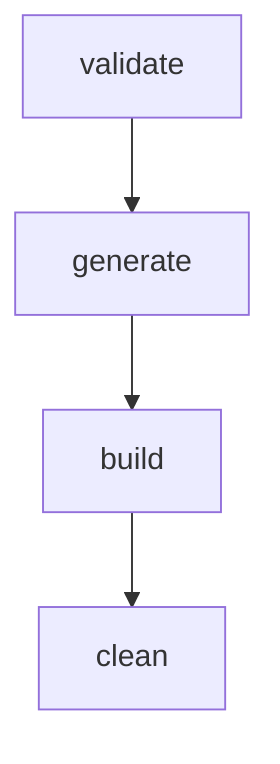

# Usage Guide

ModSmith separates your configuration and recipes from the generated code, maintaining a clean and robust workspace layout.

## Normal Workflow

The standard local development workflow in ModSmith consists of four simple steps:



1. **`modsmith validate`**
   Validates the structure of your templates, syntax of your recipes, schema of `modsmith.json`, and ensures development tools like Git are available on your system path.
   
2. **`modsmith generate`**
   Translates your recipes, parses metadata, configures build environments, and generates the mod repository files in the `MODS/` directory.

3. **`modsmith build`**
   Runs the Gradle wrappers in the generated directories to compile the targets, producing final mod `.jar` files in `WORKSPACE/DIST/`.

4. **`modsmith clean`**
   Recursively cleans the generated mod repository directories.

---

## Folder Layout

The following directories reside under your `MODSMITH_HOME` (or the folder from which you execute ModSmith if not set):

* **`MODTEMPLATES/`**
  Stores unpacked Minecraft MDK templates for various loaders and Minecraft versions (e.g., `forge-1.20.1`, `fabric-1.21`). These are used as blueprints when generating your projects.
* **`WORKSPACE/DETAILS/`**
  Contains `modsmith.json`, the main configuration file where you declare metadata, options, and compile targets.
* **`WORKSPACE/RECIPES/`**
  Place all your custom recipe JSON files here. You can use either legacy (1.20) or modern (1.21) recipe formats, and ModSmith will handle conversion.
* **`WORKSPACE/README/`**
  *Optional.* Contains a `README.md` that is automatically copied to the root of each generated mod target branch.
* **`WORKSPACE/DIST/`**
  The target folder where finalized, compiled mod release `.jar` files are copied after a successful `build`.
* **`MODS/`**
  Where the generated mod target repositories are created and managed by ModSmith.

---

## End-to-End Example: Easy Peasy Gunpowder

Here is a conceptual walk-through of creating a mod called **Easy Peasy Gunpowder** which adds a crafting recipe to turn charcoal and sulfur/sugar into gunpowder.

### Step 1: Initialize folders
Create the folder structure (if not using the Windows installer which sets this up automatically):
```
Desktop/ModSmith/
├── MODTEMPLATES/
├── WORKSPACE/
│   ├── DETAILS/
│   ├── RECIPES/
│   └── DIST/
└── MODS/
```

### Step 2: Add Unpacked Templates
Download standard Fabric, Forge, or NeoForge MDKs, unzip them, and place them into `MODTEMPLATES/` (e.g., `MODTEMPLATES/forge-1.20.1`). Make sure the gradle wrapper is present. You can verify that all your templates are valid and ready to use by running `modsmith template list`.

### Step 3: Define Mod Configuration
Create `WORKSPACE/DETAILS/modsmith.json`:
```json
{
  "mod_id": "easypeasygunpowder",
  "mod_name": "Easy Peasy Gunpowder",
  "mod_version": "1.1.0",
  "group": "com.ardaryusz.easypeasygunpowder",
  "package": "com.ardaryusz.easypeasygunpowder",
  "authors": "ardaryusz",
  "license": "MIT",
  "description": "Adds simple crafting recipes for gunpowder.",
  "output_repo_name": "EasyPeasyGunpowder",
  "targets": [
    {
      "loader": "forge",
      "template": "forge-1.20.1",
      "branch": "forge-1.20.1",
      "mc_range": "1.20.1",
      "minecraft_version": "1.20.1",
      "minecraft_version_range": "[1.20.1,1.20.2)"
    }
  ]
}
```

### Step 4: Write Recipe Files
Place a recipe file inside `WORKSPACE/RECIPES/gunpowder.json`:
```json
{
  "type": "minecraft:crafting_shapeless",
  "ingredients": [
    "minecraft:charcoal",
    "minecraft:sugar"
  ],
  "result": {
    "id": "minecraft:gunpowder",
    "count": 4
  }
}
```

### Step 5: Validate, Generate, and Build
Now run the workflow commands:
```bash
modsmith validate
modsmith generate
modsmith build
```

---

## Generated Git Branches

During the `generate` phase, ModSmith initializes a local Git repository inside `MODS/EasyPeasyGunpowder`. 

* **Orphan Branches:** ModSmith creates each configured target on an independent **orphan branch** (e.g., `forge-1.20.1`). There is no common `main` or `master` branch sharing code between targets, preventing version skew.
* **Checked-out State:** Once generation finishes, ModSmith keeps the first configured target checked out in the working directory so you can explore it or run Gradle tasks directly.

---

## DIST Output

After running `modsmith build`, the compiled binary outputs are retrieved from the build directory of each target branch and copied to your `WORKSPACE/DIST/` folder. They follow this naming convention:
```
<mod_id>-<mc_range>-<loader>-<mod_version>.jar
```
For example: `easypeasygunpowder-1.20.1-forge-1.1.0.jar`
