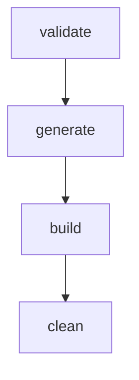

# Usage Guide

ModSmith separates your configuration and recipes from the generated code, maintaining a clean and robust workspace layout.

## Normal Workflow

The standard local development workflow in ModSmith consists of four simple steps:



1. **`modsmith validate`**
   Validates the structure of your templates, syntax of your recipes, schema of `modsmith.json`, and ensures development tools like Git are available on your system path.
   
2. **`modsmith generate`**
   Translates your recipes, parses metadata, configures build environments, and generates the mod repository files in the `MODS/` directory.

3. **`modsmith build`**
   Runs the Gradle wrappers in the generated directories to compile the targets, producing final mod `.jar` files in `WORKSPACE/DIST/`.

4. **`modsmith clean`**
   Recursively cleans the generated mod repository directories.

---

## Folder Layout

The following directories reside under your `MODSMITH_HOME` (or the folder from which you execute ModSmith if not set):

* **`MODTEMPLATES/`**
  Stores unpacked Minecraft MDK templates for various loaders and Minecraft versions (e.g., `forge-1.20.1`, `fabric-1.21`). Each template folder must contain a `modsmith-template.json` descriptor so ModSmith knows the loader, version, and recipe format to use. See [templates.md](templates.md) for details.
* **`WORKSPACE/DETAILS/`**
  Contains `modsmith.json`, the main configuration file where you declare metadata, options, and compile targets.
* **`WORKSPACE/RECIPES/`**
  Place all your custom recipe JSON files here. You can use either legacy (1.20) or modern (1.21) recipe formats, and ModSmith will handle conversion.
* **`WORKSPACE/README/`**
  *Optional.* Contains a `README.md` that is automatically copied to the root of each generated mod target branch.
* **`WORKSPACE/ASSETS/`**
  *Optional.* Stores README images and mod icons. README images use relative paths like `../ASSETS/image.png`. Mod icons are referenced in `modsmith.json` via the `icon` field.
* **`WORKSPACE/DIST/`**
  The target folder where finalized, compiled mod release `.jar` files are copied after a successful `build`.
* **`MODS/`**
  Where the generated mod target repositories are created and managed by ModSmith.

---

## End-to-End Example: Easy Peasy Gunpowder

Here is a conceptual walk-through of creating a mod called **Easy Peasy Gunpowder** which adds a crafting recipe to turn charcoal and sulfur/sugar into gunpowder.

### Step 1: Initialize folders
Create the folder structure (if not using the Windows installer which sets this up automatically):
```
Desktop/ModSmith/
├── MODTEMPLATES/
├── WORKSPACE/
│   ├── DETAILS/
│   ├── RECIPES/
│   ├── ASSETS/
│   └── DIST/
└── MODS/
```

### Step 2: Add Unpacked Templates
Download standard Fabric, Forge, or NeoForge MDKs, unzip them, and place them into `MODTEMPLATES/` (e.g., `MODTEMPLATES/forge-1.20.1`). Make sure the gradle wrapper is present.

Each template folder needs a `modsmith-template.json` descriptor. The easiest way to create one is via the GUI **Templates** screen → select the template → click **Create Descriptor** (see [templates.md](templates.md#creating-and-editing-the-descriptor-via-gui)). The form infers the loader, version, and recipe format from the folder name automatically.

You can verify that all your templates are valid and ready to use by running `modsmith template list`.

### Step 3: Define Mod Configuration
Create `WORKSPACE/DETAILS/modsmith.json`:
```json
{
  "mod_id": "easypeasygunpowder",
  "mod_name": "Easy Peasy Gunpowder",
  "mod_version": "1.1.0",
  "group": "com.ardaryusz.easypeasygunpowder",
  "package": "com.ardaryusz.easypeasygunpowder",
  "authors": "ardaryusz",
  "license": "MIT",
  "description": "Adds simple crafting recipes for gunpowder.",
  "output_repo_name": "EasyPeasyGunpowder",
  "targets": [
    {
      "loader": "forge",
      "template": "forge-1.20.1",
      "branch": "forge-1.20.1",
      "mc_range": "1.20.1",
      "minecraft_version": "1.20.1",
      "minecraft_version_range": "[1.20.1,1.20.2)"
    }
  ]
}
```

### Step 4: Write Recipe Files
Place a recipe file inside `WORKSPACE/RECIPES/gunpowder.json`:
```json
{
  "type": "minecraft:crafting_shapeless",
  "ingredients": [
    "minecraft:charcoal",
    "minecraft:sugar"
  ],
  "result": {
    "id": "minecraft:gunpowder",
    "count": 4
  }
}
```

### Step 5: Validate, Generate, and Build
Now run the workflow commands:
```bash
modsmith validate
modsmith generate
modsmith build
```

---

## Generated Git Branches

During the `generate` phase, ModSmith initializes a local Git repository inside `MODS/EasyPeasyGunpowder`. 

* **Orphan Branches:** ModSmith creates each configured target on an independent **orphan branch** (e.g., `forge-1.20.1`). There is no common `main` or `master` branch sharing code between targets, preventing version skew.
* **Checked-out State:** Once generation finishes, ModSmith keeps the first configured target checked out in the working directory so you can explore it or run Gradle tasks directly.

---

## DIST Output

After running `modsmith build`, the compiled binary outputs are retrieved from the build directory of each target branch and copied to your `WORKSPACE/DIST/` folder. They follow this naming convention:
```
<mod_id>-<mc_version_label>-<loader>-<mod_version>.jar
```
For example: `easypeasygunpowder-1.20.1-forge-1.1.0.jar`

`mc_version_label` is derived from the target's `minecraft_version` (e.g. `1.20.1`) or `from-through` for inclusive version ranges (e.g. `1.21.2-1.21.11`).

---

## Working with the GUI

ModSmith includes a clean, simple, and native desktop GUI for managing your workspace configuration, templates, recipes, and documentation.

### Workspace Config Editor
Under the **Workspace** tab, you can view and edit your active `modsmith.json` configuration inside standard native fields:
* Edit your Mod ID, Name, Version, Maven Group, Package, Authors, License, and multiline Description.
* Real-time input warning validation highlights Mod ID, Package, or Main Class errors in soft red if they violate Java or ModSmith syntax guidelines.
* Add and configure target compiler environments dynamically. You can choose loader branches (`fabric`, `forge`, `neoforge`) and select from available template blueprints via dropdown selectors.
* Clicking **Save Config** automatically saves a local backup (`modsmith.json.bak`) of your prior settings before serializing pretty-printed, UTF-8 encoded JSON to disk.
* Click **Validate Config** to execute backend checks and log validation passes or errors.

### README Documentation
ModSmith copies a `README.md` file from `WORKSPACE/README/README.md` to the root of each generated mod target branch:
* You can write and edit your `README.md` externally in your preferred Markdown or text editor inside `WORKSPACE/README/`.
* Any images used in your README can be stored inside `WORKSPACE/ASSETS/` and referenced using relative paths like `../ASSETS/<filename>`.
* During generation, the `README.md` is packaged cleanly into each target branch.

### Mod Icon Selection
In the **Workspace** tab, the **Mod Icon** section allows you to select a mod icon image:
* Click **Select Icon** to choose an image file. PNG is recommended for mod icon injection; non-PNG files are stored and previewed but not injected into generated mod projects.
* The selected icon is copied to `WORKSPACE/ASSETS/` and referenced in `modsmith.json` as `ASSETS/<filename>`.
* A 64×64 thumbnail preview is shown in the workspace editor.
* Click **Clear Icon** to remove the icon selection. Saving the config will omit the `icon` field.
* During generation, PNG icons are automatically copied to the correct loader-specific resource location and referenced in mod metadata files (`fabric.mod.json`, `mods.toml`, `neoforge.mods.toml`).

### Template Import & Descriptor Editor
In the **Templates** tab, you can easily integrate new templates without navigating filesystem directories manually:
* Click **Add Template**, input the destination folder name (e.g. `fabric-1.21.1`), and select the source directory (such as an unzipped MDK).
* The tool recursively copies files, prompts for confirmation before safely overwriting any conflicting folder, and logs success details.
* **If `modsmith-template.json` is missing**, the GUI asks: *"Create it now?"* — answering Yes opens the descriptor form with fields pre-filled from the folder name.
* You can also create or edit descriptors at any time by selecting a template row and clicking **Create Descriptor** or **Edit Descriptor**.
* Click **Open Descriptor JSON** to open `modsmith-template.json` in your system default editor.
